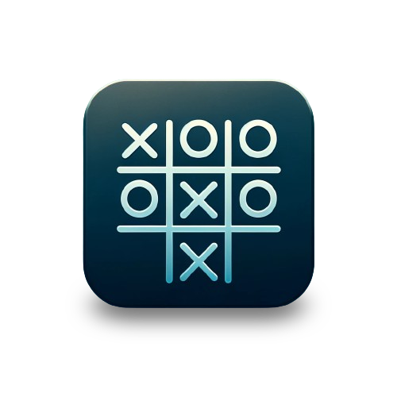

# Tic Tac Toe Game



## Overview

This Tic Tac Toe game, developed as an interactive console application in Ruby, is designed purely for fun.

It offers a playful way for two players to engage in the classic game, taking turns to place their symbols on a 3x3 grid.

## Prerequisites

Ensure you have Ruby installed on your machine to run the game. It is developed using Ruby 3.3.0.

## Installation

Clone the repository:

```bash
git clone https://github.com/dmferrari/tic-tac-toe
cd tic-tac-toe
```

Install the required gems:
  
```bash
bundle install
```

## Usage

To launch the game, navigate to the project directory and execute:

```bash
./bin/game.rb
```

Follow the on-screen instructions to play. Each player inputs their move by selecting a position from 1 to 9 on the grid.

## How to Contribute

Contributions to enhance or expand the game are welcome. To contribute:

1. Fork the repository.
2. Create a new branch for your enhancements (`git checkout -b improve-feature`).
3. Make your changes.
4. Stage your changes (`git add .`).
5. Commit your updates (`git commit -am 'Improve feature'`).
6. Push the branch (`git push origin improve-feature`).
7. Submit a Pull Request.

## License

This project is made available under the MIT License. For more details, see the LICENSE file in the repository.
